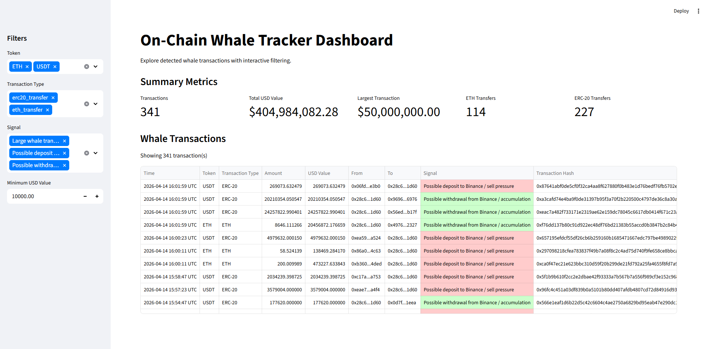

# 🐋 On-Chain Whale Tracker

An interactive analytics tool for detecting and interpreting large cryptocurrency transactions ("whale activity") on the Ethereum blockchain.

This project monitors wallet activity, identifies high-value transfers, and classifies them into meaningful signals such as **exchange inflows (sell pressure)** and **outflows (accumulation)** — similar to tools used by crypto analysts and traders.


## Features

- Tracks **ERC-20 token transfers** (USDC, USDT, WETH, DAI, etc.)
- Tracks **native ETH transactions**
- Converts all transactions into **USD value**
- Detects **whale transactions** based on configurable thresholds
- Classifies transactions into signals:
  - 📉 Exchange inflow → potential **sell pressure**
  - 📈 Exchange outflow → potential **accumulation**
  - 🔁 Wallet-to-wallet → **neutral**
- Stores data in a **SQLite database**
- Interactive **Streamlit dashboard** with:
  - Filters (token, transaction type, signal, USD value)
  - Summary metrics
  - Color-coded signals
- Clean, user-friendly interface for exploring on-chain activity


## Dashboard Preview

> *(Add your screenshot here)*

Example:

```md

```


## How It Works

1. **Data Collection**
   - Fetches transaction data from the Ethereum blockchain using the Etherscan API

2. **Processing**
   - Normalizes token amounts (handles decimals)
   - Converts ETH from Wei → ETH

3. **Enrichment**
   - Retrieves token prices from CoinGecko
   - Calculates USD value for each transaction

4. **Detection**
   - Filters transactions above a configurable whale threshold

5. **Analysis**
   - Classifies transactions based on exchange wallet interactions

6. **Storage**
   - Saves results in a SQLite database

7. **Visualization**
   - Displays results in an interactive Streamlit dashboard


## Installation & Setup

### 1. Clone the repository

```bash
git clone https://github.com/your-username/onchain-whale-tracker.git
cd onchain-whale-tracker
```

### 2. Create virtual environment

```bash
python -m venv venv
```
Activate it:

### Windows

```bash
venv\Scripts\activate
```

### Mac/Linux

```bash
source venv/bin/activate
```

### 3. Install dependencies

```bash
python -m pip install -r requirements.txt
```

### 4. Set up environment variables
Create a `.env` file in the root directory:

```env
ETHERSCAN_API_KEY=your_api_key_here
COINGECKO_API_KEY=your_api_key_here
```

### 5. Run the whale tracker (data collection)

```bash
python -m app.main
```

### 6. Launch the dashboard

```bash
streamlit run app/dashboard.py
```


## Project Structure

```text
onchain-whale-tracker/
│
├── app/
│   ├── main.py              # Entry point for data collection
│   ├── dashboard.py         # Streamlit dashboard
│   ├── fetcher.py           # API calls (Etherscan, CoinGecko)
│   ├── processor.py         # Data normalization
│   ├── filters.py           # Whale filtering logic
│   ├── analyzer.py          # Signal classification
│   ├── storage.py           # SQLite storage
│   ├── config.py            # Configurations & constants
│   └── utils.py             # Helper functions
│
├── data/
│   └── whale_transactions.db
│
├── .streamlit/
│   └── config.toml          # Dashboard theme settings
│
├── requirements.txt
├── README.md
└── .env
```

